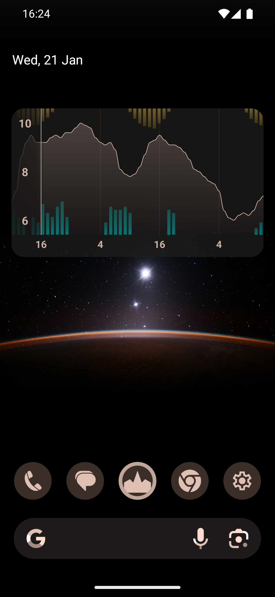
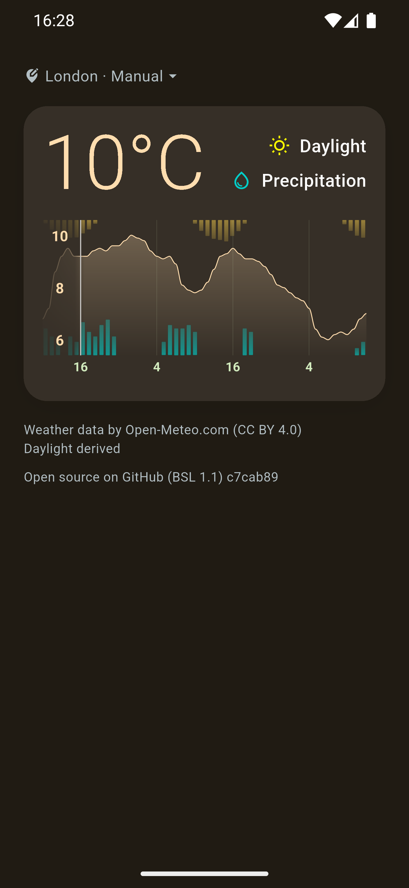
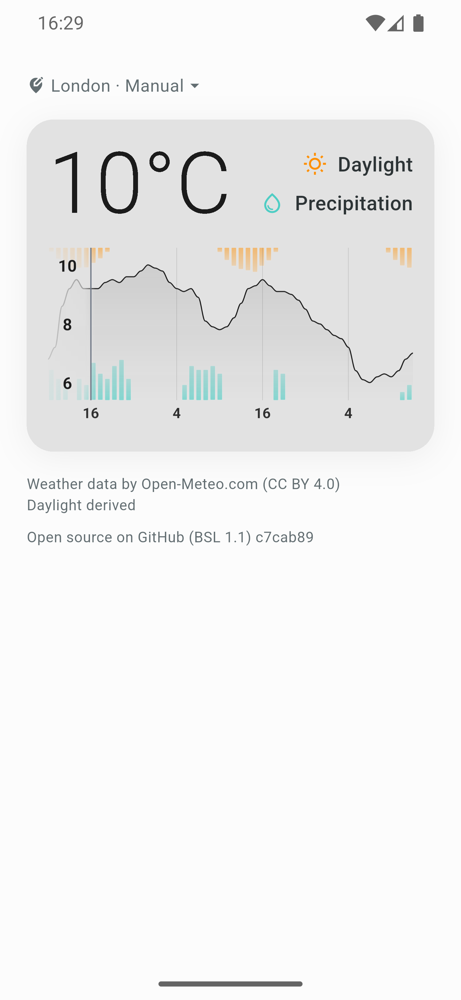

# Meteograph

Open-source Android weather widget that puts a detailed forecast directly on
your home screen — no ads, no tracking, no account. Choose a 48-hour or 7-day
meteogram with temperature, precipitation, and daylight on a single glanceable
chart. Powered by the free Open-Meteo API.

<a href="https://play.google.com/store/apps/details?id=org.bortnik.meteogram">
  
</a>


## Features

- **Two home-screen widgets**: 48-hour chart (46h forecast + 6h past) and
  7-day chart, both rendered natively via AndroidSVG
- **Meteogram chart** with:
  - Temperature line with gradient fill
  - Precipitation bars
  - Daylight intensity (computed from cloud cover and sun position)
  - Current time marker
  - Weekday labels (weekly) / hour labels (48h)
- **Smart refresh**:
  - Foreground timer checks every minute for stale data (>15 min) and
    redraws at half-hour boundaries
  - AlarmManager (~15 min inexact) catches up on device wake
  - WorkManager periodic task (~30 min) with network-connected constraint
  - BOOT_COMPLETED refresh on device restart
  - Event-driven updates (screen unlock, network change, locale/timezone change)
- **Flexible location**:
  - GPS with reverse geocoding (native platform geocoder)
  - City search via Open-Meteo geocoding API
  - Recent cities remembered
  - Berlin default when GPS unavailable
- **Material You** dynamic color support (Android 12+)
- **Light/dark theme** following system preference
- **36 languages** supported
- **Locale-aware units** (°F for US/Liberia/Myanmar, °C elsewhere; 12/24h time)
- **Offline support** with smart caching:
  - Automatic cache fallback when offline
  - Fibonacci retry backoff (1, 2, 3, 5, 8 min) for background refresh
  - Visual "OFFLINE" watermark on stale data (>1 hour old)
  - Cached location and city name preserved
- **No API key required** — uses free Open-Meteo API
- **No ads, no tracking, no account**

## Screenshots

<p>
  
  
  
  
</p>

## Installation

### Prerequisites

- Flutter 3.x
- Android SDK
- Android device or emulator

### Build & Run

```bash
# Get dependencies
flutter pub get

# Generate localizations
flutter gen-l10n

# Build options (via Makefile)
make debug          # x86_64 only (68MB) - for emulator
make release        # arm64 only (19MB) - for phones
make install        # Build release + install on device
make install-debug  # Build debug + install on emulator
```

### Install Widget

1. Install the app on your device
2. Open the app and let it load weather data
3. Long-press on home screen → Widgets
4. Find "Meteograph" and drag to home screen
5. Tap widget to refresh data

## Project Structure

```
lib/
├── main.dart                     # App entry point, edge-to-edge setup
├── generated/version.dart        # Generated git version info (gitignored)
├── l10n/                         # Localization files (36 languages)
│   ├── app_en.arb                # English (template)
│   └── app_*.arb                 # ar, be, bg, bn, bs, cs, da, de, el, es,
│                                 # fi, fr, hi, hr, is, it, ja, jv, ka, ko,
│                                 # mk, nl, no, pa, pl, pt, ro, sk, sq, sv,
│                                 # ta, tr, uk, vi, zh
├── screens/
│   └── home_screen.dart          # Main app screen (both chart panels)
├── services/
│   ├── location_service.dart     # GPS + city search + reverse geocoding
│   ├── widget_service.dart       # Home widget updates via home_widget
│   ├── native_svg_service.dart   # Method channel to Kotlin (SVG / weather / cache)
│   ├── units_service.dart        # Temperature unit and 12/24h logic
│   └── material_you_service.dart # Material You color pass-through
├── theme/
│   └── app_theme.dart            # Colors, themes, Material You mapping
└── widgets/
    └── native_svg_chart_view.dart # PlatformView wrapper for native SVG

android/app/src/main/kotlin/.../
├── MainActivity.kt                   # Flutter activity + method channel
├── MeteogramApplication.kt           # Receiver registration, alarm schedule
├── MeteogramWidgetProvider.kt        # Base widget (48h) — shared logic
├── MeteogramWeeklyWidgetProvider.kt  # 7-day variant (extends base)
├── WidgetEventReceiver.kt            # Locale / timezone / network receiver
├── WidgetAlarmScheduler.kt           # 15-min inexact AlarmManager
├── WidgetAlarmReceiver.kt            # Alarm broadcast handler
├── BootCompletedReceiver.kt          # Refresh on device boot
├── WidgetUtils.kt                    # Shared widget helpers
├── WidgetChartColors.kt              # Material You color resolver
├── WeatherUpdateWorker.kt            # WorkManager periodic refresh (~30 min)
├── WeatherFetcher.kt                 # Native HTTP client for Open-Meteo
├── WeatherDataParser.kt              # Cached-weather parser + chart views
├── SvgChartGenerator.kt              # Native SVG generator (single source of truth)
├── MaterialYouColorExtractor.kt      # Dynamic color extraction
├── MaterialYouColorWorker.kt         # Background color updates
├── SvgChartPlatformView.kt           # In-app native SVG rendering
└── SvgChartViewFactory.kt            # PlatformView factory

android/app/src/main/res/
├── layout/meteogram_widget.xml              # 48h widget layout
├── layout/meteogram_widget_weekly.xml       # 7-day widget layout
├── xml/meteogram_widget_info.xml
├── xml/meteogram_widget_weekly_info.xml
└── drawable/widget_background.xml
```

## API

Uses [Open-Meteo](https://open-meteo.com/) free APIs (no API key required):

### Weather Forecast
```
GET https://api.open-meteo.com/v1/forecast
  ?latitude={lat}
  &longitude={lon}
  &hourly=temperature_2m,precipitation,cloud_cover
  &timezone=UTC
  &past_hours=32
  &forecast_days=7
```

The 32-hour past window keeps the weekly chart's "now" line at the same
fraction of width as the 48-hour chart. The 48-hour chart slices a smaller
window (6h past + 46h future) from the same cache.

Returns hourly data for:
- `temperature_2m` — temperature in Celsius
- `precipitation` — rain/snow in mm
- `cloud_cover` — cloud coverage percentage (0-100)

Daylight intensity is computed locally from cloud cover and solar position.

### City Search (Geocoding)
```
GET https://geocoding-api.open-meteo.com/v1/search
  ?name={query}
  &count=8
  &language={locale}
```

The `language` parameter uses the user's current locale so results come
back in their preferred language.

## Widget Technical Details

### Android Widget

The home screen widgets use:
- `HomeWidgetProvider` from the home_widget package
- `RemoteViews` for native Android widget rendering
- SVG chart generated in Kotlin (`SvgChartGenerator.kt`) and rasterised via AndroidSVG
- AlarmManager (~15 min inexact), WorkManager (~30 min with network constraint),
  and BOOT_COMPLETED for reliable background refresh
- Event receivers for unlock / network / locale / timezone changes

**RemoteViews Limitations:**
- Only supports: TextView, ImageView, LinearLayout, RelativeLayout, FrameLayout
- Does NOT support: View, Space, custom views

### Data Flow

1. **Foreground**: `home_screen.dart` → `NativeSvgService.fetchWeather()` →
   Kotlin `WeatherFetcher` pulls from Open-Meteo → caches to SharedPreferences
2. **SVG generation**: `SvgChartGenerator.kt` reads the cache and produces an
   SVG string — single source of truth used by both the in-app chart and both widgets
3. **In-app**: SVG rendered via native PlatformView (AndroidSVG)
4. **Widget**: SVG rasterised to a bitmap and shown in an ImageView
5. **Background**: AlarmManager / WorkManager / BOOT_COMPLETED / event receivers
   trigger a native refresh + widget re-render, Flutter engine stays off

## Customization

### Colors

Edit `lib/theme/app_theme.dart` for the in-app UI and
`android/app/src/main/kotlin/.../SvgChartGenerator.kt` for the chart itself
(`SvgChartColors.light` / `SvgChartColors.dark`). Example from the Dart side:

```dart
static const light = MeteogramColors(
  temperatureLine: Color(0xFFFF6B6B),    // Coral red
  precipitationBar: Color(0xFF1A9D92),   // Deeper teal (legibility on white)
  daylightBar: Color(0xFFFF8F00),        // Dark amber
  nowIndicator: Color(0xFFFFE66D),       // Golden yellow
  // ...
);
```

### Widget Background

Edit `android/app/src/main/res/drawable/widget_background.xml`:

```xml
<gradient
    android:startColor="#BA1B2838"
    android:endColor="#BA0D1B2A"
    android:angle="135" />
<corners android:radius="24dp" />
```

## Adding Languages

1. Create `lib/l10n/app_XX.arb` (copy from app_en.arb)
2. Translate all strings
3. Run `flutter gen-l10n`

Supported locales are auto-detected from ARB files.

## Dependencies

| Package | Purpose |
|---------|---------|
| home_widget | Android/iOS widget support |
| geolocator | GPS location |
| geocoding | Reverse geocoding (city names) |
| http | API requests |
| path_provider | File storage |
| shared_preferences | Settings storage |
| intl | Locale-aware formatting |

Material You theming uses native Android color extraction (`MaterialYouColorExtractor.kt`).

## License

Business Source License 1.1 - see [LICENSE](LICENSE)

- Free for non-commercial and personal use
- Commercial use requires a license
- Converts to MIT on 2029-01-01

## Contributing

Contributions welcome! Please read the existing code style and test your changes.

## Acknowledgments

- Weather data: [Open-Meteo](https://open-meteo.com/)
- Widget support: [home_widget](https://pub.dev/packages/home_widget)
- SVG rendering: [AndroidSVG](https://bigbadaboom.github.io/androidsvg/)
